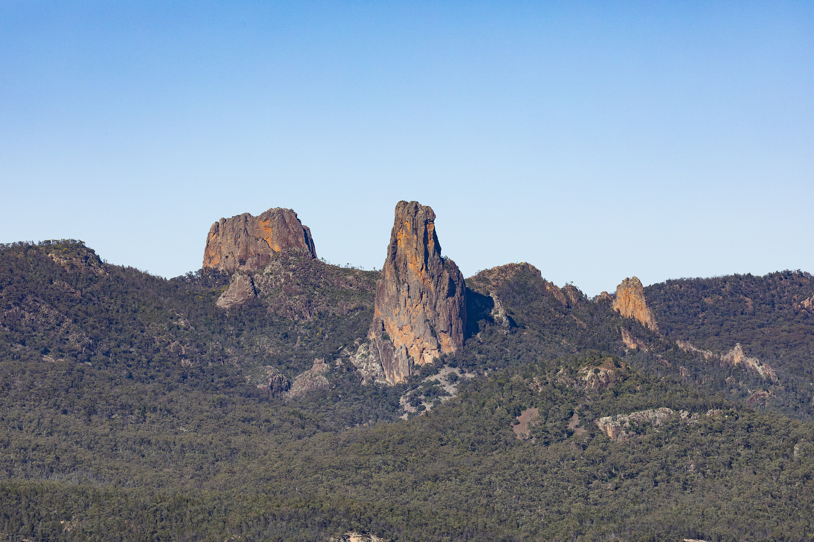

## Why this walk

This is where the write-up starts: why you picked this walk, who came, and how you got to the trackhead. Write it like you would tell it over coffee.

## Day by day

Use a heading per day, or per section of track. Paragraphs can be as long or short as you like.

Photos can sit between paragraphs like the one above. Put the image file in this walk's folder and reference it by name.

## What we would do differently

A short closing section works well: what you would pack, skip or change next time.
